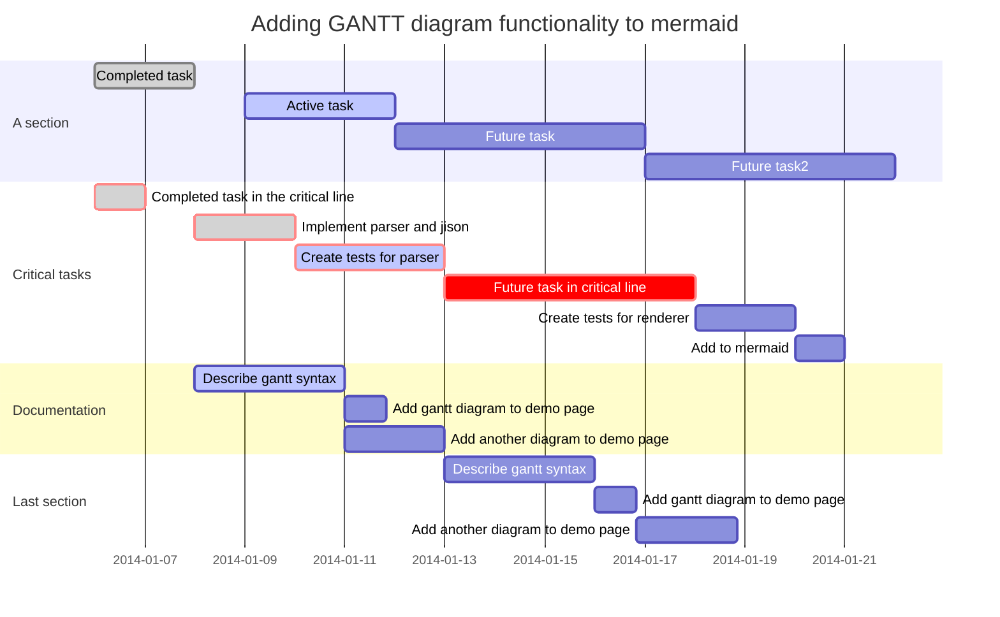

# 前端技术知识点大全

整理前端各种知识点，将知识点按照使用情况进行分级。

1️⃣ 表示基础知识，必须知道，不知道无法开发。

2️⃣ 表示开发特定场景会遇到，最好知道。

3️⃣ 表示开发是基本不用真正用到的，用于深入了解的知识。

[前端工程师必备技能.xmind](./files/前端工程师必备技能.xmind)

```mermaid
gantt
  dateFormat  YYYY-MM-DD
  title Adding GANTT diagram functionality to mermaid

  section A section
  Completed task            :done,    des1, 2014-01-06,2014-01-08
  Active task               :active,  des2, 2014-01-09, 3d
  Future task               :         des3, after des2, 5d
  Future task2              :         des4, after des3, 5d

  section Critical tasks
  Completed task in the critical line :crit, done, 2014-01-06,24h
  Implement parser and jison          :crit, done, after des1, 2d
  Create tests for parser             :crit, active, 3d
  Future task in critical line        :crit, 5d
  Create tests for renderer           :2d
  Add to mermaid                      :1d

  section Documentation
  Describe gantt syntax               :active, a1, after des1, 3d
  Add gantt diagram to demo page      :after a1  , 20h
  Add another diagram to demo page    :doc1, after a1  , 48h

  section Last section
  Describe gantt syntax               :after doc1, 3d
  Add gantt diagram to demo page      :20h
  Add another diagram to demo page    :48h

```